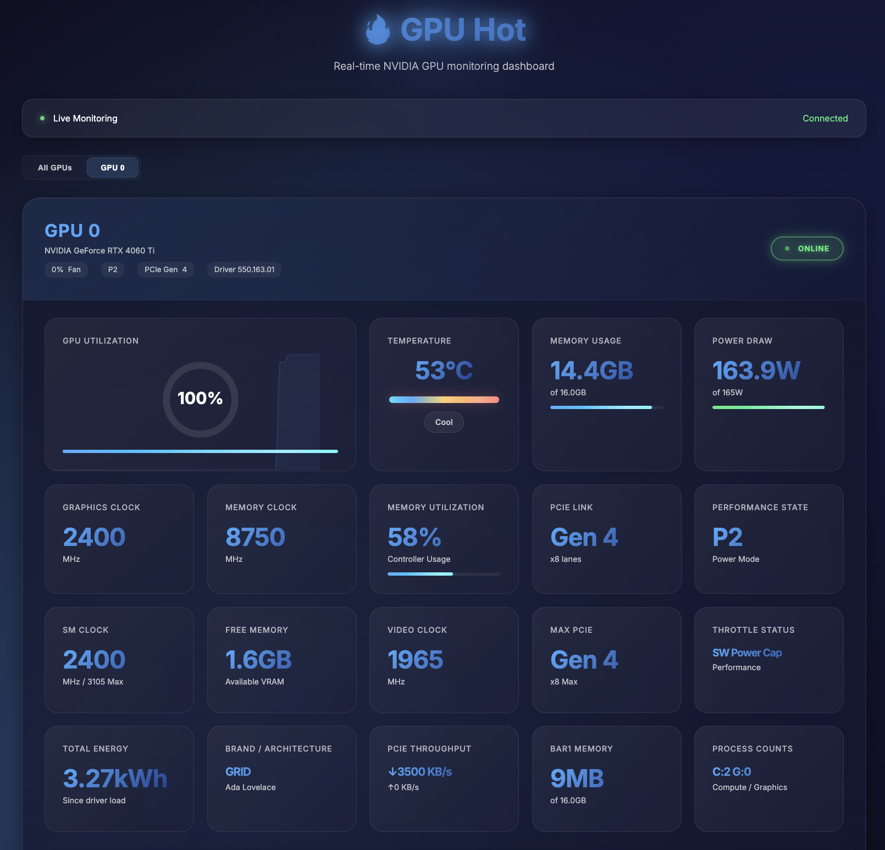

<div align="center">

# GPU Hot

Real-time NVIDIA GPU monitoring dashboard. Web-based, no SSH required.

[](https://www.python.org/)
[](https://www.docker.com/)
[](LICENSE)
[](https://www.nvidia.com/)



</div>

---

## Usage

Monitor a single machine or an entire cluster with the same Docker image.

**Single machine:**
```bash
docker run -d --gpus all -p 1312:1312 ghcr.io/psalias2006/gpu-hot:latest
```

**Multiple machines:**
```bash
# On each GPU server
docker run -d --gpus all -p 1312:1312 -e NODE_NAME=$(hostname) ghcr.io/psalias2006/gpu-hot:latest

# On a hub machine (no GPU required)
docker run -d -p 1312:1312 -e GPU_HOT_MODE=hub -e NODE_URLS=http://server1:1312,http://server2:1312,http://server3:1312 ghcr.io/psalias2006/gpu-hot:latest
```

Open `http://localhost:1312`

**Older GPUs:** Add `-e NVIDIA_SMI=true` if metrics don't appear.

**Process monitoring:** Add `--init --pid=host` to see process names. Note: This allows the container to access host process information.

**From source:**
```bash
git clone https://github.com/psalias2006/gpu-hot
cd gpu-hot
docker-compose up --build
```

**Requirements:** Docker + [NVIDIA Container Toolkit](https://docs.nvidia.com/datacenter/cloud-native/container-toolkit/latest/install-guide.html)

---

## Features

- Real-time metrics (sub-second)
- Automatic multi-GPU detection
- Process monitoring (PID, memory usage)
- Historical charts (utilization, temperature, power, clocks)
- System metrics (CPU, RAM)
- Scale from 1 to 100+ GPUs

**Metrics:** Utilization, temperature, memory, power draw, fan speed, clock speeds, PCIe info, P-State, throttle status, encoder/decoder sessions

### Export Features

**Snapshot exports:**
- **JSON Export** - Machine-readable metrics + 60s history
- **HTML Report** - Professional, printable, self-contained report
- **Chart Images** - High-resolution PNG screenshots

**Use cases:** Bug reports, documentation, capacity planning

**How to use:** Click "📊 Export" button → Select format → Downloads automatically

---

## Configuration

**Environment variables:**
```bash
NVIDIA_VISIBLE_DEVICES=0,1     # Specific GPUs (default: all)
NVIDIA_SMI=true                # Force nvidia-smi mode for older GPUs
GPU_HOT_MODE=hub               # Set to 'hub' for multi-node aggregation (default: single node)
NODE_NAME=gpu-server-1         # Node display name (default: hostname)
NODE_URLS=http://host:1312...  # Comma-separated node URLs (required for hub mode)
```

**Backend (`core/config.py`):**
```python
UPDATE_INTERVAL = 0.5  # Polling interval
PORT = 1312            # Server port
```

---

## API

### HTTP
```bash
GET /              # Dashboard
GET /api/gpu-data  # JSON metrics
```

### WebSocket
```javascript
socket.on('gpu_data', (data) => {
  // Updates every 0.5s (configurable)
  // Contains: data.gpus, data.processes, data.system
});
```
---

## Project Structure

```bash
gpu-hot/
├── app.py                      # Flask + WebSocket server
├── core/
│   ├── config.py               # Configuration
│   ├── monitor.py              # NVML GPU monitoring
│   ├── handlers.py             # WebSocket handlers
│   ├── routes.py               # HTTP routes
│   └── metrics/
│       ├── collector.py        # Metrics collection
│       └── utils.py            # Metric utilities
├── static/
│   ├── js/
│   │   ├── charts.js           # Chart configs
│   │   ├── gpu-cards.js        # UI components
│   │   ├── socket-handlers.js  # WebSocket + rendering
│   │   ├── ui.js               # View management
│   │   └── app.js              # Init
│   └── css/styles.css
├── templates/index.html
├── Dockerfile
└── docker-compose.yml
```

---

## Troubleshooting

**No GPUs detected:**
```bash
nvidia-smi  # Verify drivers work
docker run --rm --gpus all nvidia/cuda:12.1.0-base-ubuntu22.04 nvidia-smi  # Test Docker GPU access
```

**Hub can't connect to nodes:**
```bash
curl http://node-ip:1312/api/gpu-data  # Test connectivity
sudo ufw allow 1312/tcp                # Check firewall
```

**Performance issues:** Increase `UPDATE_INTERVAL` in `core/config.py`

---

## Star History

[](https://www.star-history.com/#psalias2006/gpu-hot&type=date&legend=top-left)

## Contributing

PRs welcome. Open an issue for major changes.

## License

MIT - see [LICENSE](LICENSE)
